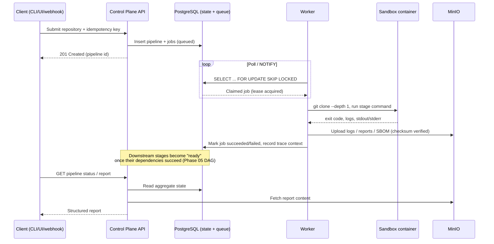

# Data Flow

## A single pipeline run, end to end

## Why trace context has to survive the queue hop

A normal in-process trace (API handler calling a function) propagates
context automatically through the call stack. Shipyard's flow crosses a
**queue boundary**: the code that enqueues a job and the code that
executes it run in different processes, often minutes apart. If the trace
context (the W3C `traceparent`) is not explicitly stored on the job row at
enqueue time and read back by the worker at claim time, the trace breaks
into two disconnected halves — one for "API accepted the submission," one
for "worker ran the stage" — and nothing links them.

This is why [ADR-003](../adr/ADR-003-postgres-as-queue.md) and Phase 09's
telemetry design treat the job row as carrying more than just "what to
run" — it also carries "how to keep this observable across a process and
time boundary."

## Idempotency

The client's idempotency key (a unique constraint on the pipeline
submission) prevents a retried or duplicated request from creating a
second pipeline run. This is the one place Shipyard can make a precise,
narrow "exactly-once" claim: exactly-once *pipeline creation* for a given
key — not exactly-once *job execution*, which is at-least-once by design
(see [ADR-003](../adr/ADR-003-postgres-as-queue.md), detailed in
Phase 04).
