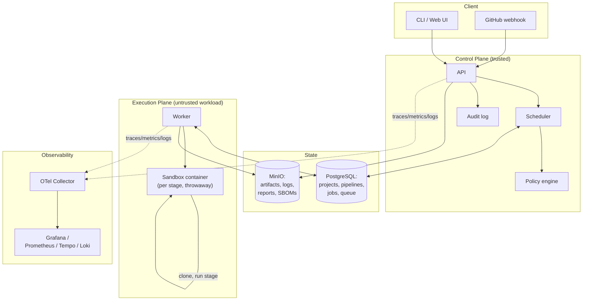

# System Overview

## Purpose

Shipyard takes a repository, runs it through a pipeline of validation and
security stages inside isolated containers, and returns a structured report.
This document is the map: what the major components are, how they relate,
and where the trust boundaries sit. Detail on any one component lives in
its own file ([control-plane.md](control-plane.md),
[execution-plane.md](execution-plane.md)); the threat analysis lives in
[threat-model.md](threat-model.md).

## Components

## The two planes

- **Control plane**: accepts submissions, holds state, schedules work,
  evaluates policy, records an audit trail. It never executes repository
  code. See [control-plane.md](control-plane.md).
- **Execution plane**: workers that claim jobs from the queue and run each
  pipeline stage inside a throwaway, resource-limited container. This is
  the only place untrusted code runs. See
  [execution-plane.md](execution-plane.md).

This split exists because the control plane holds everything valuable —
project metadata, credentials, policy, audit history. If it executed
repository code directly, a single hostile submission could compromise the
whole system rather than just its own sandbox. See
[threat-model.md](threat-model.md) for the full reasoning.

## Data at rest

- **PostgreSQL** is the source of truth for all state and doubles as the
  durable job queue (see [ADR-003](../adr/ADR-003-postgres-as-queue.md)).
- **MinIO** holds everything too large or too binary for a database row:
  logs, test reports, SBOMs, scan reports, build artifacts.

## Observability

Every component emits traces, metrics, and structured logs via
OpenTelemetry from Phase 09 onward. It is designed in from here so that
adding it later doesn't require retrofitting instrumentation into
components that weren't built with a trace context in mind — see
[data-flow.md](data-flow.md) for where trace context must survive a queue
hop.

## What is deliberately not shown here

Kubernetes, a service mesh, multiple environments (staging/prod) — none
of these exist in Shipyard's design. See
[docs/product/non-goals.md](../product/non-goals.md).
